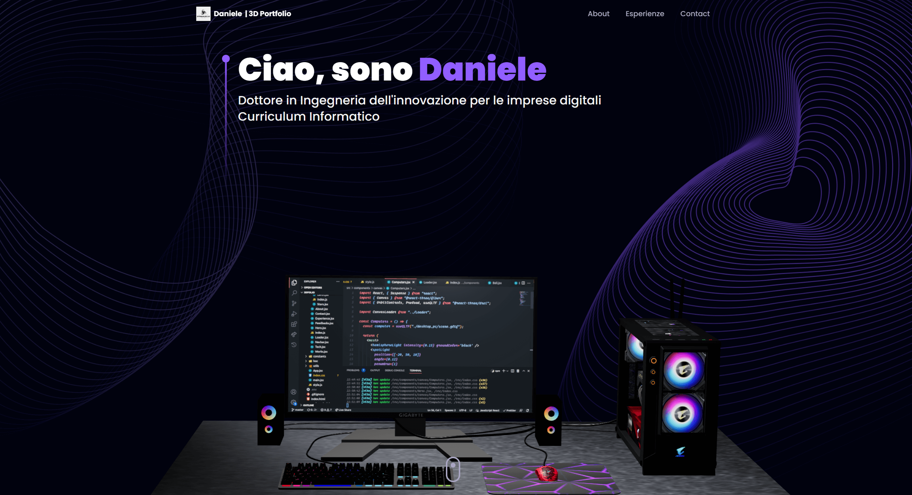

<a name="readme-top"></a>
<div align="center">

  

  <h1>Three.js 3D Portfolio</h1>
  
  <p>
    Three.js 3D Portfolio is a modern UI/UX and functional Developer Portfolio Web built with React & Three.js
  </p>

<!-- Badges -->
<p>
  <a href="https://github.com/EmmanuelloDaniele/3D-Porfolio/graphs/contributors">
    
  </a>
  <a href="">
    
  </a>
  <a href="https://github.com/EmmanuelloDaniele/3D-Porfolio/network/members">
    
  </a>
  <a href="https://github.com/EmmanuelloDaniele/3D-Porfolio/stargazers">
    
  </a>
  <a href="https://github.com/EmmanuelloDaniele/3D-Porfolio/issues/">
    
  </a>
  <a href="https://github.com/EmmanuelloDaniele/3D-Porfolio/blob/master/LICENSE">
    
  </a>
</p>
   
 <h4>
    <a href="https://emmanuello.vercel.app/">View Demo</a>
  <span> · </span>
    <a href="https://github.com/EmmanuelloDaniele/3D-Porfolio">Documentation</a>
  <span> · </span>
    <a href="https://github.com/EmmanuelloDaniele/3D-Porfolio/issues/">Report Bug</a>
  <span> · </span>
    <a href="https://github.com/EmmanuelloDaniele/3D-Porfolio/issues/">Request Feature</a>
  </h4>
</div>

<br />

<!-- Table of Contents -->
<details>

<summary>

# :notebook_with_decorative_cover: Table of Contents

</summary>

- [About the Project](#star2-about-the-project)
  * [Folder Structure](#bangbang-folder-structure)
  * [Tech Stack](#space_invader-tech-stack)
- [Getting Started](#toolbox-getting-started)
  * [Installation](#gear-installation)
  * [Run Locally](#running-run-locally)
- [Contributing](#wave-contributing)
- [License](#warning-license)
- [Contact](#handshake-contact)
- [Acknowledgements](#gem-acknowledgements)

</details>  

<!-- About the Project -->
## :star2: About the Project

<div align="center">
  
</div>

<br />

This repository houses an well-designed and functional Developer Portfolio Website consisting Navbar, Hero, Overview, Work Experience, Technologies, Projects, Testimonials and Contact sections built with React & Three.js using TailwindCSS ⏭

<!-- Folder Structure -->
### :bangbang: Folder Structure

Here is the folder structure of 3D-Portfolio.
```bash
Threejs_3D_Portfolio/
|- public/
|- src/
  |-- assets/
  |-- components/
  |-- constants/
  |-- hoc/
  |-- utils/
  |-- App.jsx
  |-- index.css
  |-- main.jsx
  |-- styles.js
|- postcss.config.cjs
|- tailwind.config.cjs
|- vite.config.js
```
<br />

<!-- TechStack -->
### :space_invader: Tech Stack

[](https://skillicons.dev)

<p align="right">(<a href="#readme-top">back to top</a>)</p>

<!-- Getting Started -->
## :toolbox: Getting Started

<!-- Installation -->
### :gear: Installation

#### Step 1:
Download or clone this repo by using the link below:

```bash 
https://github.com/EmmanuelloDaniele/3D-Porfolio.git
```

#### Step 2:

3D-Portfolio using NPM (Node Package Manager), therefore, make sure that Node.js is installed by execute the following command in console:

```bash
  node -v
```

#### Step 3:

At the main folder execute the following command in console to get the required dependencies:

```bash
  npm install --legacy-peer-deps
```

#### Step 4:

At the main folder execute the following command in console to creates a build directory with a production build of 3d portfolio:

```bash
  npm run build
```

#### Step 5:

At the main folder execute the following command in console to run the server:

```bash
  npm run start
```

<!-- Run Locally -->
### :running: Run Locally

#### Step 1:

At the main folder execute the following command in console to get the required dependencies:

```bash
  npm install --legacy-peer-deps
```

#### Step 2:

At the main folder execute the following command in console to run the development server:

```bash
  npm run dev
```

<p align="right">(<a href="#readme-top">back to top</a>)</p>


<!-- Contact -->
## :handshake: Contact
<p dir="auto">Daniele Emmanuello - <a href="https://www.linkedin.com/in/emmanuellodaniele/" rel="nofollow">@Linkedin</a> -<a href="https://t.me/emmanuellodaniele"rel="nofollow">@Telegram</a></p> 

## # More info  :handshake: Contact

[](https://www.buymeacoffee.com/emmanuello) <p dir="auto">Daniele Emmanuello - <a href="https://www.linkedin.com/in/emmanuellodaniele/" rel="nofollow">@Linkedin-</a>       <a href="https://t.me/emmanuellodaniele"rel="nofollow">@Telegram</a></p> 

<p align="right">(<a href="#readme-top">back to top</a>)</p>

<!-- Acknowledgments -->
## :gem: Acknowledgements

This section used to mention useful resources and libraries that used in 3D Portfolio

 - [Email JS](https://www.emailjs.com/)
 - [Framer Motion](https://www.framer.com/motion/)
 - [React Tilt](https://www.npmjs.com/package/react-tilt)
 - [React Vertical Timeline Component](https://www.npmjs.com/package/react-vertical-timeline-component)
 - #JSMastery

<p align="right">(<a href="#readme-top">back to top</a>)</p>


